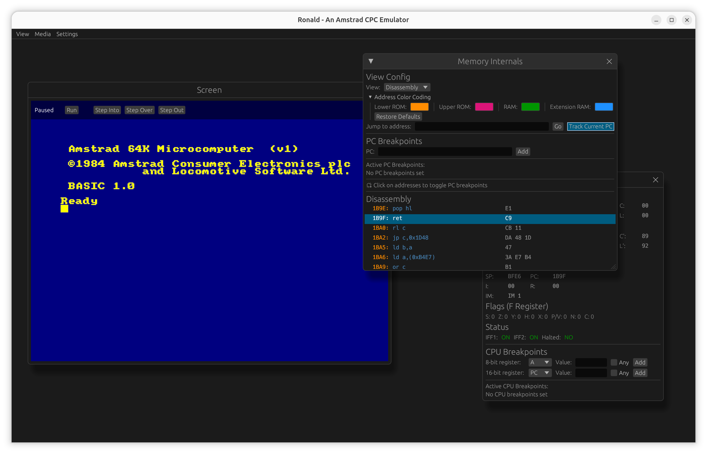

Ronald - An Amstrad CPC Emulator
================================

Ronald is an emulator for the Amstrad CPC written in Rust. It was written as a
way to teach myself more about both emulators and Rust. It runs a couple of
games that I remember fondly from my childhood.

## Features

* Supports the CPC 464 and 664 models. The 6128 model is work in progress
* Can load DSK disk images. Tape image loading is not yet supported
* Workbench mode with extensive debugging capabilities
* Accurate audio support (thanks to the excellent [psg](https://github.com/thedjinn/psg-rs) crate)
* Includes a key binding editor to easily use keys not present on modern keyboards
* Can be compiled to WebAssembly and runs in a browser

Running The Emulator
--------------------

If you have Rust installed you can easily run the emulator from the command line
using

`cargo run --release`

Make sure to run it from the `ronald-egui` directory to ensure the default key bindings are loaded. Otherwise you will not be able to interact with the emulator via your keyboard without setting up your own key bindings first.
